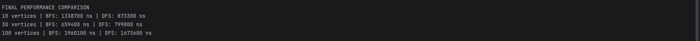

# Assignment 4: Graph Traversal and Representation System

## A. Project Overview

This project implements a graph traversal and representation system in Java. The graph is represented using an adjacency list, where every vertex stores a list of its connected neighboring vertices.

A graph consists of:

- **Vertices**: nodes of the graph. In this project, vertices are represented as `V0`, `V1`, `V2`, and so on.
- **Edges**: connections between vertices. This project uses an undirected graph, so an edge from `V0` to `V1` also means that `V1` is connected to `V0`.

The project implements two graph traversal algorithms:

- **Breadth-First Search (BFS)**
- **Depth-First Search (DFS)**

The program creates three graphs of different sizes:

| Graph Size | Number of Vertices |
|---|---:|
| Small | 10 |
| Medium | 30 |
| Large | 100 |

The program runs BFS and DFS on each graph and measures execution time using `System.nanoTime()`.

---

## B. Class Descriptions

### Vertex.java

The `Vertex` class represents a single node in the graph.

Private field:

- `id`: unique identifier of the vertex

Main methods:

- Constructor: creates a vertex with a given ID
- `getId()`: returns the vertex ID
- `toString()`: returns the vertex in readable format, for example `V0`

### Edge.java

The `Edge` class represents a connection between two vertices.

Private fields:

- `source`: starting vertex
- `destination`: ending vertex

Main methods:

- Constructor: creates an edge between two vertices
- Getters: return source and destination vertices
- `toString()`: returns the edge in readable format, for example `V0 -> V1`

### Graph.java

The `Graph` class stores the whole graph structure.

Main fields:

- `vertices`: stores all vertices by their ID
- `adjacencyList`: stores each vertex and its connected neighbors
- `directed`: defines whether the graph is directed or undirected

Main methods:

- `addVertex(Vertex vertex)`: adds a vertex to the graph
- `addEdge(int from, int to)`: adds an edge between two vertices
- `printGraph()`: prints the adjacency list
- `bfs(int start)`: performs Breadth-First Search
- `dfs(int start)`: performs Depth-First Search
- `getVertexCount()`: returns the number of vertices
- `getEdgeCount()`: returns the number of edges

### Experiment.java

The `Experiment` class handles testing and analysis.

Main methods:

- `runTraversals(Graph graph)`: runs BFS and DFS on one graph
- `runMultipleTests()`: creates small, medium, and large graphs and tests them
- `printResults()`: prints final performance comparison

### Main.java

The `Main` class starts the program. It creates an `Experiment` object, runs all tests, and prints the final results.

---

## C. Algorithm Descriptions

## Breadth-First Search (BFS)

Breadth-First Search explores the graph level by level. It first visits the starting vertex, then all direct neighbors, then neighbors of those neighbors.

### Step-by-step explanation

1. Start from the selected vertex.
2. Mark it as visited.
3. Put it into a queue.
4. While the queue is not empty:
   - Remove the first vertex from the queue.
   - Print or process it.
   - Add all unvisited neighbors to the queue.
5. Continue until all reachable vertices are visited.

### Data structure used

BFS uses a **queue** because a queue follows FIFO order: first in, first out.

### Use cases

BFS is useful when:

- finding the shortest path in an unweighted graph;
- exploring level-by-level relationships;
- checking connectivity;
- solving problems where the nearest solution is needed first.

### Time complexity

The time complexity of BFS is:

`O(V + E)`

where:

- `V` is the number of vertices;
- `E` is the number of edges.

Each vertex is visited once, and each edge is checked during traversal.

---

## Depth-First Search (DFS)

Depth-First Search explores the graph by going as deep as possible along one branch before returning and trying another branch.

### Step-by-step explanation

1. Start from the selected vertex.
2. Push it into a stack.
3. While the stack is not empty:
   - Remove the top vertex from the stack.
   - If it is not visited, mark it as visited and print it.
   - Push its unvisited neighbors into the stack.
4. Continue until all reachable vertices are visited.

### Data structure used

DFS uses a **stack** because a stack follows LIFO order: last in, first out.

### Use cases

DFS is useful when:

- detecting cycles;
- solving maze/backtracking problems;
- exploring connected components;
- performing topological sorting in directed acyclic graphs.

### Time complexity

The time complexity of DFS is:

`O(V + E)`

Each vertex is visited once, and each edge is checked during traversal.

---

## D. Experimental Results

The program was tested on three graph sizes: 10, 30, and 100 vertices.

### Execution Time Comparison

Sample execution results:

| Graph Size | Edges | BFS Time | DFS Time |
|---:|---:|---:|---:|
| 10 vertices | 14 edges | 2,903,710 ns | 2,602,453 ns |
| 30 vertices | 48 edges | 4,694,241 ns | 4,149,017 ns |
| 100 vertices | 167 edges | 11,600,163 ns | 11,705,020 ns |

The exact execution time can change depending on the computer, Java version, and current system load.

### Small Graph Traversal Output

BFS traversal from `V0`:

```text
V0 V1 V2 V5 V3 V4 V6 V7 V8 V9
```

DFS traversal from `V0`:

```text
V0 V1 V2 V3 V4 V5 V6 V7 V8 V9
```

### Observations and Patterns

As the graph size increases, execution time also increases. This happens because BFS and DFS must process more vertices and more edges.

In this experiment, DFS was slightly faster for the 10-vertex and 30-vertex graphs, while BFS was slightly faster for the 100-vertex graph. The difference is small because both algorithms have the same theoretical complexity: `O(V + E)`.

The result matches the expected complexity because the running time grows together with the number of vertices and edges.

---

## E. Screenshots





---

## F. Analysis Questions

### 1. How does graph size affect BFS and DFS performance?

When graph size increases, both BFS and DFS take more time because they need to visit more vertices and check more edges. A graph with 100 vertices requires more operations than a graph with 10 vertices.

### 2. Which traversal is faster in your experiments?

In the sample run, DFS was slightly faster for the 10-vertex and 30-vertex graphs. BFS was slightly faster for the 100-vertex graph. However, the difference is not large. Both algorithms are efficient and have the same time complexity.

### 3. Do results match the expected complexity `O(V + E)`?

Yes. The results match the expected complexity because the execution time increases as the number of vertices and edges increases. Both algorithms visit every reachable vertex and check its edges.

### 4. How does graph structure affect traversal order?

Graph structure affects the order in which vertices are visited. BFS visits vertices level by level, so it processes all close neighbors first. DFS goes deeper into one path before returning to another branch. Also, the order of neighbors inside the adjacency list affects the exact traversal output.

### 5. When is BFS preferred over DFS?

BFS is preferred when we need the shortest path in an unweighted graph or when we need to explore the graph level by level. For example, BFS is useful in social networks, shortest path problems, and finding the nearest target.

### 6. What are the limitations of DFS?

DFS can go very deep before finding the correct solution. In recursive implementations, it can also cause stack overflow on very large graphs. DFS does not always find the shortest path in an unweighted graph, so it is not the best choice when the shortest route is required.

---

## G. Reflection

This assignment helped me understand how graphs can be represented in Java using an adjacency list. I learned that vertices are the main nodes of a graph, while edges describe connections between them. I also practiced implementing clean OOP structure with separate classes for `Vertex`, `Edge`, `Graph`, `Experiment`, and `Main`.

The main difference between BFS and DFS is the way they explore a graph. BFS uses a queue and visits vertices level by level. DFS uses a stack and goes deep into one branch before returning. The most challenging part was making sure that vertices were not visited more than once and that the graph worked correctly for different sizes.


## How to Run

From the project root folder:

```bash
javac src/*.java
java -cp src Main
```

Expected output includes:

- graph structure for the small graph;
- BFS traversal output;
- DFS traversal output;
- execution time for 10, 30, and 100 vertices;
- final performance comparison.
